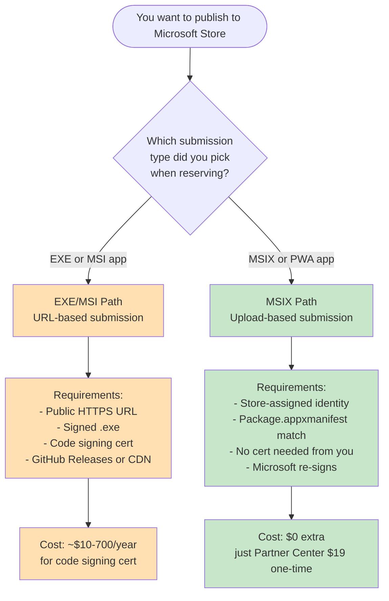
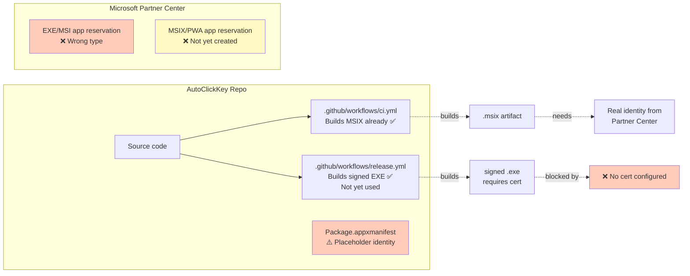
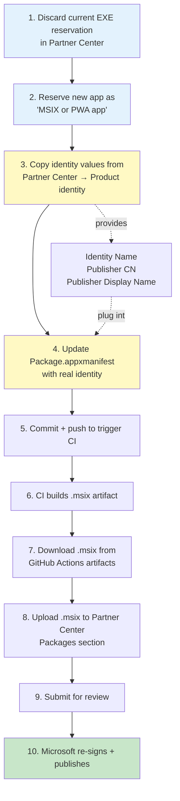
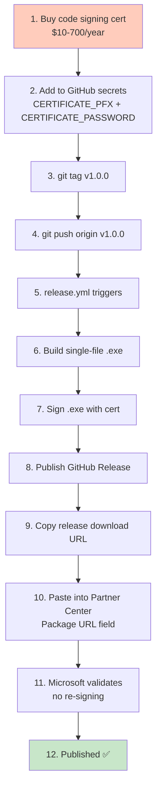
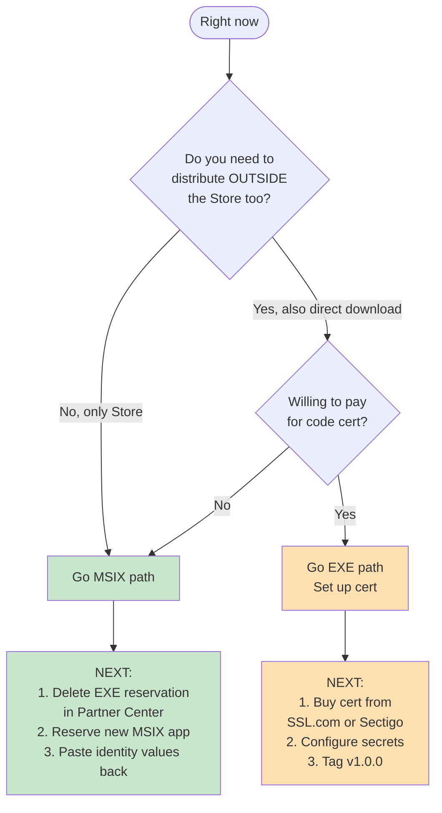

# Microsoft Store Submission Workflow

This doc explains the full workflow for publishing a .NET WPF desktop app (like **AutoClickKey**) to the Microsoft Store.

**Source app reference**: `D:\Programing\_app\app-auto-key-click-x-claude`

---

## 1. Big Picture — Two Possible Paths

**Recommendation for AutoClickKey**: MSIX path (green). Cheaper, simpler, already mostly built.

---

## 2. Current State — Where You Are Now

---

## 3. MSIX Path — Full Workflow (Recommended)

### MSIX Path — Component View

```mermaid
flowchart LR
    Dev([You]) -->|git push tag| GitHub[GitHub Repo]
    GitHub --> Actions[GitHub Actions CI<br/>ci.yml]
    Actions --> Build[dotnet build]
    Build --> Publish[dotnet publish<br/>WindowsPackageType=MSIX]
    Publish --> Wack[WACK Validation]
    Wack --> Artifact[.msix artifact]
    Artifact --> Dev2([You download])
    Dev2 -->|manual upload| Partner[Partner Center<br/>Packages]
    Partner --> Review[Microsoft Review<br/>Certification]
    Review --> Sign[MS re-signs with<br/>Store cert]
    Sign --> Store[Microsoft Store<br/>Published ✅]

    style Actions fill:#fff9c4
    style Store fill:#c8e6c9
```

---

## 4. EXE Path — Full Workflow (Alternative)

Only use this if you want to distribute OUTSIDE the Store too (e.g., direct download from your website).

### EXE Path — Component View

```mermaid
flowchart LR
    Dev([You]) -->|git push tag| GitHub[GitHub Repo]
    GitHub --> Actions[GitHub Actions<br/>release.yml]
    Actions --> Build[dotnet publish<br/>PublishSingleFile=true]
    Build --> Sign[signtool sign<br/>with your cert]
    Sign --> Release[GitHub Release<br/>+ signed .exe]
    Release --> URL[Public HTTPS URL]
    URL -->|paste URL| Partner[Partner Center<br/>Package URL field]
    Partner --> Review[Microsoft Review]
    Review --> Download[Customers download<br/>from your URL]

    style Actions fill:#fff9c4
    style Review fill:#fff9c4
```

---

## 5. Side-by-Side Comparison

| Aspect | MSIX Path ✅ | EXE Path |
|--------|-------------|----------|
| **Cost** | $0 | $10–700/year (cert) |
| **Signing** | Microsoft signs for you | You must sign |
| **Cert required** | No | Yes (trusted CA) |
| **Hosting** | Microsoft hosts | You host (GitHub Releases) |
| **Update flow** | Upload new .msix | Tag → auto-release → update URL |
| **SmartScreen** | Clean | Warnings until reputation builds |
| **WACK validation** | Required (already in CI) | Not required |
| **Auto-updates** | Store handles | Store handles |
| **Customer install** | From Store app | Store downloads your .exe |
| **Your CI** | ✅ Already works | Needs cert in secrets |

---

## 6. Decision Tree — What To Do RIGHT NOW

---

## 7. Your Immediate Next Steps (Assuming MSIX Path)

1. **In Partner Center browser tab**:
   - Close/discard the current EXE submission draft
   - Delete the EXE product (or keep it parked and use a new name)
   - Click **+ New product → MSIX or PWA app**
   - Reserve your app name

2. **After reservation, navigate to**:
   - Your new MSIX app → **Product management → Product identity**
   - Copy three values:
     - Package/Identity Name
     - Publisher (starts with `CN=`)
     - Publisher display name

3. **Paste them back to me** — I'll:
   - Update `Package.appxmanifest` in AutoClickKey repo
   - Remove the `release.yml` workflow (no longer needed for MSIX)
   - Push to trigger CI → MSIX artifact
   - Show you how to download + upload the artifact

---

## Glossary

- **MSIX**: Modern Windows app package format. Sandboxed. Auto-updates via Store.
- **WACK**: Windows App Certification Kit. Tests MSIX for Store compliance.
- **Partner Center**: Microsoft's portal where developers submit apps.
- **Package identity**: Unique Publisher+Name combo that identifies your app in the Store.
- **SmartScreen**: Windows safety filter. Unsigned/low-rep EXEs trigger warnings.
- **Code signing cert**: Cryptographic cert used to sign .exe files. Proves publisher identity.
- **EV cert**: Extended Validation cert. Instant SmartScreen trust. More expensive.
